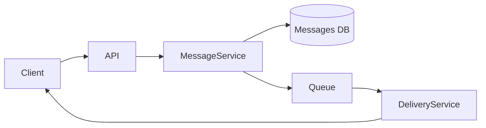
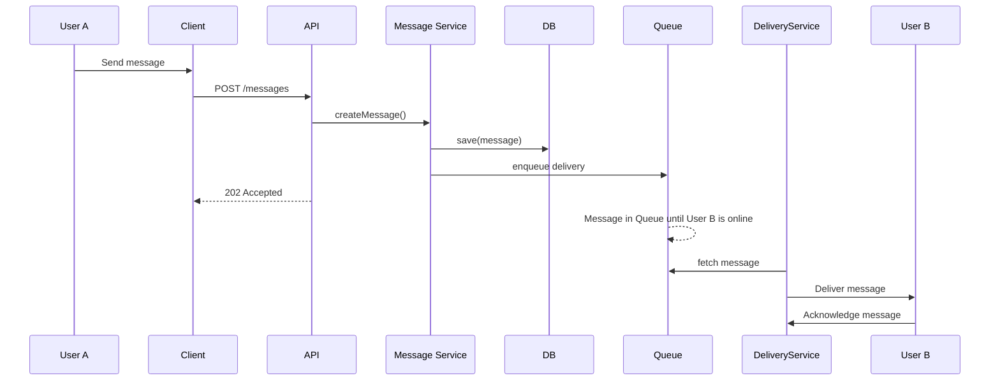
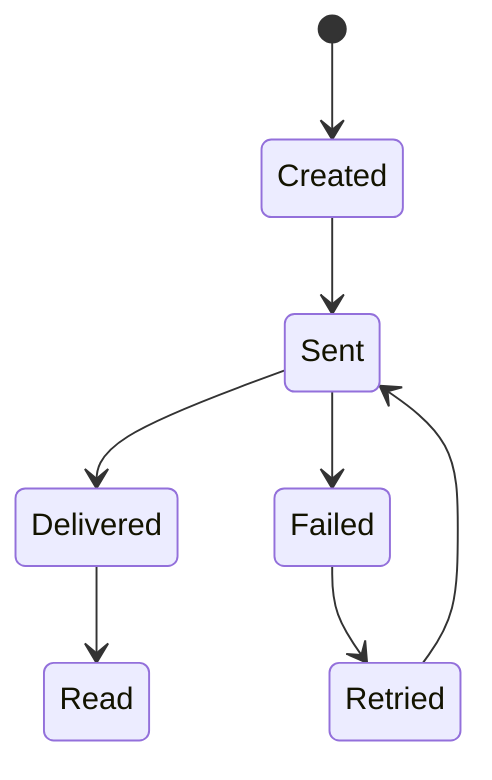

# Part 1 — Component Diagram (30%)

## Task
Create a Component Diagram that shows:

- system components,
- their responsibilities,
- interactions between them.

## Required components
- **Client (Web / Mobile)**: User interface where users can send and receive messages.
- **Backend API**: Manages user requests and interacts with other system components.
- **Message Service**: Handles the logic for message creation, status updates (sent, delivered, read).
- **Database**: Stores messages and their statuses.
- **Delivery mechanism (Queue / WebSocket / Push)**: Ensures messages are delivered asynchronously, even when users are offline.

## Component Diagram

---
## Part 2 — Sequence Diagram (25%)
### Scenario
User A sends a message to User B who is offline.

### Task
Describe the interaction sequence in time, i.e., how the request to send a message from User A to User B (who is currently offline) is processed.

### Sequence Diagram

---
## Part 3 — State Diagram (20%)
### Object
`Message`

### Task
Describe the **message lifecycle**.

---

## Part 4 — ADR (Architecture Decision Record) (25%)
# RFC: Message Delivery Strategy

## Context
Users can be online or offline when messages are sent.

## Problem
Messages must not be lost and delivery status must be reliable.

## Proposed Solution
Use asynchronous delivery with a queue and client acknowledgements. If a user is offline, the message will stay in the queue until the user is online, and then the system will attempt delivery.

## Alternatives
- Direct delivery only (rejected): Direct delivery would require clients to be online, which could result in message loss.
- Client polling (considered): Polling was considered but discarded as inefficient compared to using a message queue.

## Consequences
+ Reliable delivery even for offline users.
- Increased system complexity due to queue management.
