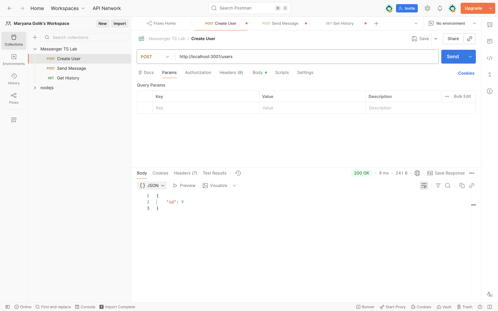
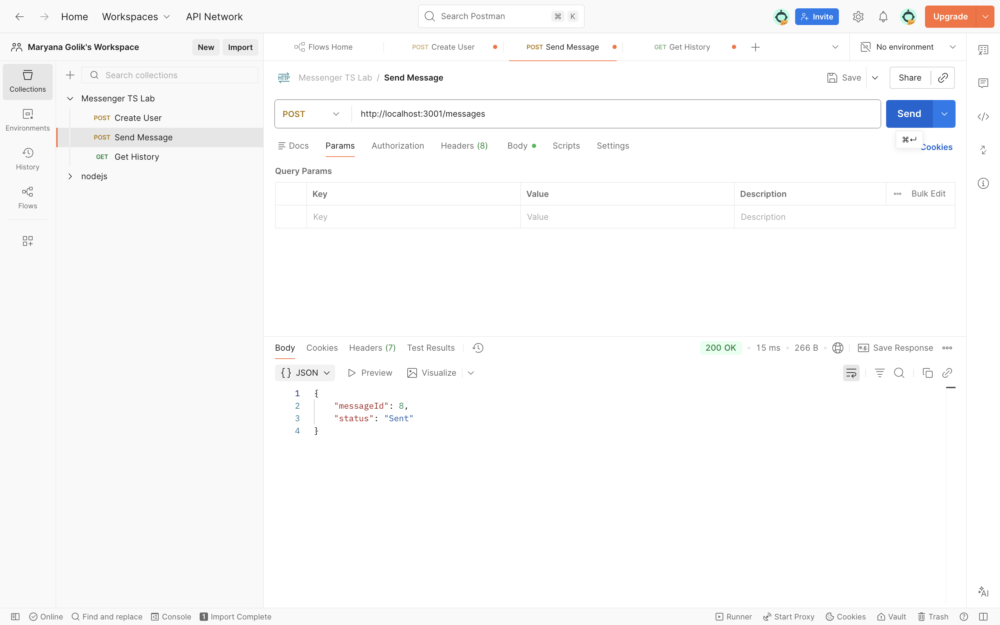
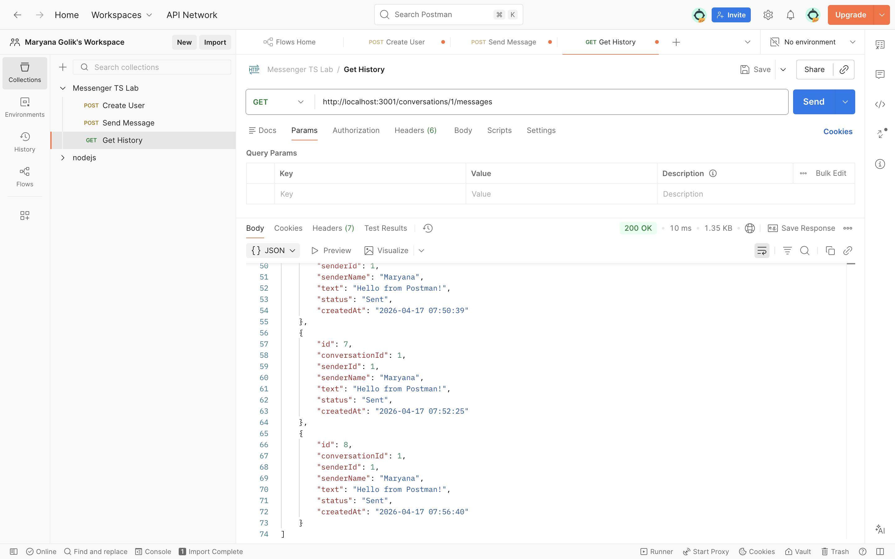

# 📌 Messaging System Prototype (Variant 2)

This project is a functional prototype of a messaging system developed as part of the **"Software Design and Documentation"** course. The system is built using a modular TypeScript architecture, focusing on reliable message lifecycle tracking and data persistence.

**Core Focus:** Implementation of **Variant 2 — Message Status Tracking**. The project emphasizes the state machine logic and the lifecycle of a message from creation to consumption.

## 🚀 Key Features

* **User Management:** Simple creation and identification of unique users.
* **Message Persistence:** Utilizing **SQLite** to guarantee that every message and its status history is saved, even if the server restarts.
* **Status Tracking (Variant 2):** Full implementation of a message state machine: `Sent` ➡️ `Delivered` ➡️ `Read`.
* **Data Integrity:** Uses SQL joins to provide rich historical data, including sender names directly in the message history.
* **Separation of Concerns:** A clean directory structure separating API routes, business logic, and database configuration.

## 📂 Project Structure

The project follows a modular design to ensure scalability and maintainability:

```text
/lab-2
├── src
│   ├── api          # Express.js route definitions (routes.ts)
│   ├── models       # TypeScript interfaces and Status types (types.ts)
│   ├── services     # Business logic and SQL queries (MessageService.ts)
│   ├── storage      # SQLite connection and schema initialization (database.ts)
│   ├── tests        # Integration tests for automated verification (tests.ts)
│   └── main.ts      # Server entry point and DB initialization
├── messenger.db     # SQLite database file (auto-generated)
├── package.json     # Node.js dependencies and scripts
├── tsconfig.json    # TypeScript compiler configuration
└── postman_collection.json  # Pre-configured API requests for testing

🛠️ How to Run
1. Install Dependencies
Ensure you have Node.js installed. Run the following command in the project root:

Bash
npm install
2. Start the Server
Use the TypeScript loader to run the server (adjust the port in main.ts if necessary, e.g., 3000):

Bash
node --loader ts-node/esm src/main.ts
The API will be available at: http://localhost:3000

3. Running Integration Tests
To verify the "Create User -> Send Message -> Get History" flow automatically:

Bash
node --loader ts-node/esm src/tests/tests.ts
📊 Data Model
The system utilizes a specialized data model to support the Message Status Tracking requirements:

User: id (Primary Key), name.

Message: * id: Unique identifier.

conversationId: Groups messages into threads.

senderId: Linked to the User ID.

senderName: Retrieved via SQL Join for rich history views.

status: Current state of the message (Sent, Delivered, Read, Failed, Retried).

createdAt: Timestamp of message creation.

📝 Architecture ADR (Brief)
Decision: State-Machine-Based Tracking.

Reasoning: To meet the requirements of Variant 2, a "Sent" status is assigned immediately upon DB entry. The system is designed to update these statuses based on client acknowledgments.

Reliability: By using SQLite as the primary storage engine, we ensure that message statuses are never lost due to application crashes or network timeouts.

Join Logic: Instead of duplicating data, the system dynamically joins the Users and Messages tables to provide human-readable history while maintaining database normalization.


## 📸 API Demonstration (Postman)

Below are the screenshots of the working API endpoints:

### 1. Create User


### 2. Send Message


### 3. Get History (with Sender Name)

